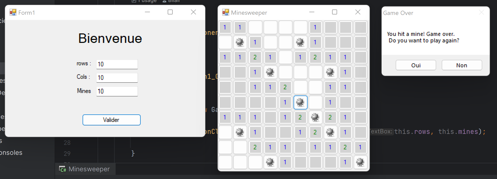

# Demineur

# Description 
Home : 
- Choix du nombre de colonne et de lignes
- Choix du nombre de mines

Game : 
écran de jeux, les règles du démineur : 
- cliquer sur une case pour la dévoiler
- si c'est une mine vous avez perdu
- si il n'y a pas de mine adjacente, il indique le nombre de mines adjacentes
# autheur
BEN YAHIA Bilail 